# Spring

# 配置文件

```
<!-- https://mvnrepository.com/artifact/org.springframework/spring-webmvc -->
<dependency>
    <groupId>org.springframework</groupId>
    <artifactId>spring-webmvc</artifactId>
    <version>5.2.8.RELEASE</version>
</dependency>
```

# Spring 简介

## Spring 概述

> **Spring** 是最受欢迎的企业级 Java 应用程序开发框架，数以百万的来自世界各地的开发人员使用 Spring 框架来创建性能好、易于测试、可重用的代码。**Spring** 框架是一个开源的 Java 平台，它最初是由 **Rod Johnson** 编写的，并且于 2003 年 6 月首次在 Apache 2.0 许可下发布。**Spring** 是轻量级的框架，其基础版本只有 2 MB 左右的大小。**Spring** 框架的核心特性是可以用于开发任何 Java 应用程序，但是在 Java EE 平台上构建 web 应用程序是需要扩展的。 **Spring 框架的目标是使 J2EE 开发变得更容易使用**，通过启用基于 **POJO** 编程模型来促进良好的编程实践。

## Spring 优良特性


> - **非侵入式**：基于Spring开发的应用中的对象可以不依赖于Spring的API
> - **控制反转**：IOC——Inversion of Control，指的是将对象的创建权交给 Spring 去创建。使用 Spring 之前，对象的创建都是由我们自己在代码中new创建。而使用 Spring 之后。对象的创建都是由给了 Spring 框架。
> - **依赖注入**：DI——Dependency Injection，是指依赖的对象不需要手动调用 setXX 方法去设置，而是通过配置赋值。
> - **面向切面编程**：Aspect Oriented Programming——AOP
> - **容器**：Spring 是一个容器，因为它包含并且管理应用对象的生命周期
> - **组件化**：Spring 实现了使用简单的组件配置组合成一个复杂的应用。在 Spring 中可以使用XML和Java注解组合这些对象。
> - **一站式**：在 IOC 和 AOP 的基础上可以整合各种企业应用的开源框架和优秀的第三方类库（实际上 Spring 自身也提供了表述层的 SpringMVC 和持久层的 Spring JDBC）

**
**

**总结：****Spring就是一个轻量级的控制反转（IOC）和面向切面编程（AOP）的容器（框架）！**

## Spring 体系结构

​               **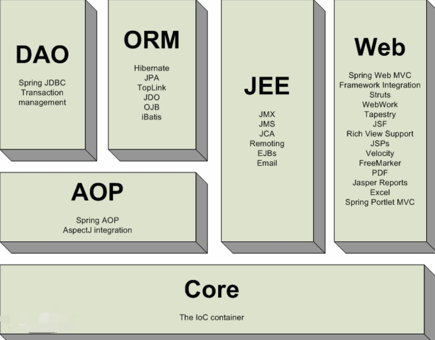**

# IOC

## IoC 容器

- **Spring 容器是 Spring 框架的核心。**容器将创建对象，把它们连接在一起，配置它们，并管理他们的整个***生命周期\***从创建到销毁。
- Spring 容器使用**依赖注入**（DI）来管理组成一个应用程序的组件。这些对象被称为 **Spring Beans**，通过 XML，Java 注解或 Java 代码来表示。
- 下图是 Spring 如何工作的高级视图。

​       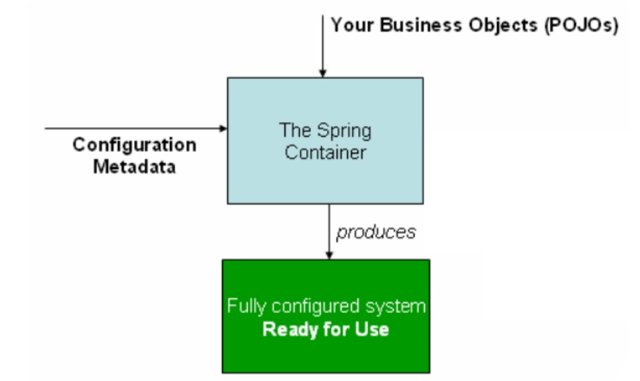

-  Spring IoC 容器利用 Java 的 POJO 类和配置元数据来生成完全配置和可执行的系统或应用程序。
- **IOC 容器**具有**依赖注入**功能的容器，它可以创建对象，IOC 容器负责实例化、定位、配置应用程序中的对象及建立这些对象间的依赖。

​         

Spring 提供了以下两种不同类型的容器。

| 序号 | 容器 & 描述                                                  |
| ---- | ------------------------------------------------------------ |
| 1    | [Spring BeanFactory 容器](https://www.w3cschool.cn/wkspring/j3181mm3.html)它是最简单的容器，给 DI 提供了基本的支持，它用 org.springframework.beans.factory.BeanFactory 接口来定义。BeanFactory 或者相关的接口，如 BeanFactoryAware，InitializingBean，DisposableBean，在 Spring 中仍然存在具有大量的与 Spring 整合的第三方框架的反向兼容性的目的。 |
| 2    | [Spring ApplicationContext 容器](https://www.w3cschool.cn/wkspring/yqdx1mm5.html)该容器添加了更多的企业特定的功能，例如从一个属性文件中解析文本信息的能力，发布应用程序事件给感兴趣的事件监听器的能力。该容器是由 org.springframework.context.ApplicationContext 接口定义。 |

**ApplicationContext** 容器包括 **BeanFactory** 容器的所有功能，**所以通常不建议使用BeanFactory**。BeanFactory 仍然可以用于轻量级的应用程序，如移动设备或基于 applet 的应用程序，其中它的数据量和速度是显著。

## IOC 理论推导

**USerDao接口**

```
public interface UserDao {
    void getUser();
}
```

**UserDaoImpl**

```
public class UserDaoImpl implements UserDao {
    public void getUser() {
        System.out.println("默认获取用户的数据!!!");
    }
}
public class UserDaoMysqlImpl implements UserDao {
    public void getUser() {
        System.out.println("Mysql 获取用户数据 ！！！");
    }
}
public class UserDaoOracleImpl implements UserDao {
    public void getUser() {
        System.out.println("Oracle 获取用户数据！！！");
    }
}
```

**UserService接口**

```
public interface UserService {
    void getUser();
}
```

**UserServiceImpl**

```
public class UserServiceImpl implements UserService {
    private UserDao userDao =null;
    public void setUserDao(UserDao userDao) {
        this.userDao = userDao;
    }
    public void getUser() {
        userDao.getUser();
    }
}
```

**Test**

```
public class MyTest {
    public static void main(String[] args) {
        UserServiceImpl userService = new UserServiceImpl();
        userService.setUserDao( new UserDaoImpl());
        userService.setUserDao( new UserDaoMysqlImpl());
        userService.setUserDao( new UserDaoOracleImpl());
        userService.getUser();
    }
}
```

## IOC的本质

**控制反转：通常new一个实例，控制权由程序员控制，而"控制反转"是指new实例工作不由程序员来做而是交给Spring容器来做****。** 

IOC 是一种编程思想，由主动的编程编程被动的接收，可通过`new ``ClassPathXmlApplicationContext`去浏览一下底层源码。

**实体类：Hello.java**

```
package edu.cqupt.poio;

public class Hello {
    private String str;
    public String getStr() {
        return str;
    }
    public void setStr(String str) {
        this.str = str;
    }
    @Override
    public String toString() {
        return "Hello{" +
                "str='" + str + '\'' +
                '}';
    }
}
```

**配置文件：beans.xml**

```
<?xml version="1.0" encoding="UTF-8"?>
<beans xmlns="http://www.springframework.org/schema/beans"
       xmlns:xsi="http://www.w3.org/2001/XMLSchema-instance"
       xsi:schemaLocation="http://www.springframework.org/schema/beans
        https://www.springframework.org/schema/beans/spring-beans.xsd">
     
    <bean id="hello" class="edu.cqupt.poio.Hello">
         <!--给对象中的属性设置一个值-->
         <property name="str" value="Spring"/>
     </bean>
</beans>
```

**测试类：**

```
 public static void main(String[] args) {
        //获取spring的上下文对象
       ApplicationContext context = new ClassPathXmlApplicationContext("beans.xml");
       Hello hello = (Hello)context.getBean("hello");
       System.out.println(hello.toString());
}
```

​                   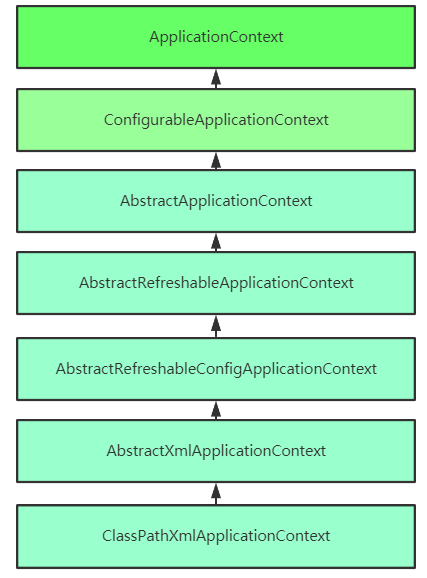

## IOC 创建对象的方式

```
 <bean id="user"  class="edu.cqupt.pojo.User">
        <!--通过参数索引 调用有参构造-->
        <constructor-arg index="0" value="shilin"/>
</bean>
<bean id="user"  class="edu.cqupt.pojo.User">
         <!--通过参数类型 调用有参构造-->
        <constructor-arg type="java.lang.String" value="shilin"/>
</bean>
```

**总结**： 在配置文件加载的时候，**Spring容器**中管理的对象就已经被初始化了。

## Spring 配置

### 别名

```
 <alias name="user" alias="userNew"/>
 
 User user = (User) context.getBean("userNew");
```

### bean的配置

```
    <!--
    id： bean 的唯一标识符，也就相当于对象名
    class： bean 对象所对应的全限定名： 包名 + 类型
    name: 也就是起别名 而且name可以取多个别名
    -->
    <bean id="userT" class="edu.cqupt.pojo.UserT" name="userT2，u2,u3,u4" >
        <constructor-arg name="name" value="shilin"/>
    </bean>
```

### import

import，一般用于团队开发使用，他可以将多个配置文件，导入合并为一个

```
<import resource="beans.xml"/>
<import resource="beans2.xml"/>
<import resource="beans3.xml"/>
```

# 依赖注入

## 构造器注入

前面提过

## Set方式注入【重点】

- 依赖注入

- - 依赖：bean对象的创建依赖于容器！
  - 注入：bean对象的所有属性，有容器来注入！

【环境搭建】

- 复杂类型
- 真实测试对象

```
package edu.cqupt.pojo;

import java.util.*;
public class Student {
    private String name;
    private Addresss addresss;
    private String[] books;
    private List<String> hobbies;
    private Map<String,String> card;
    private Set<String> games;
    private String wife;
    private Properties info;
    ...gets/sets
}

package edu.cqupt.pojo;
public class Addresss {
    private String address;
    ...gets/sets

}
```

**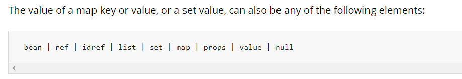**

**普通注入**

```
 <bean id="student" class="edu.cqupt.pojo.Student">
    <property name="name" value="shi_lin"/>
</bean>
```

**Beans 注入**

```
<bean id="address" class="edu.cqupt.pojo.Addresss">
    <property name="address" value="重庆"/>
</bean>

  <!--Bean注入： ref-->
<property name="addresss" ref="address"/>
```

**数组注入**

```
<!--数组注入： array-->
<property name="books">
    <array>
       <value>Java 程序设计</value>
       <value>Python 从入门到精通</value>
      <value>MYSQL 必知必会</value>
    </array>
</property>
```

**List 注入**

```
<!--List 注入-->
<property name="hobbies">
    <list>
        <value>编程</value>
        <value>听音乐</value>
        <value>看电影</value>
    </list>
</property>
```

**Map 注入**

```
<!--Map 注入-->
<property name="card">
    <map>
        <entry key="学生卡" value="1234567"/>
        <entry key="身份证" value="123453232367"/>
        <entry key="银行卡" value="3332434343434343"/>
    </map>
</property>
```

**Set 注入**

```
<!--Set 注入-->
<property name="games">
    <set>
        <value>LOL</value>
        <value>王者荣耀</value>
        <value>BOB</value>
    </set>
</property>
```

**Null 注入**

```
<!--Null 注入-->
<property name="wife">
    <null/>
</property>
```

**properties 注入**

```
<!--properties 注入-->
<property name="info">
    <props>
        <prop key="driver">com.mysql.jdbc.Driver</prop>
        <prop key="url">jdbc:mysql://localhost:3306/mydb</prop>
        <prop key="username">root</prop>
        <prop key="password">123456</prop>
    </props>
</property>
```

## 拓展方式注入

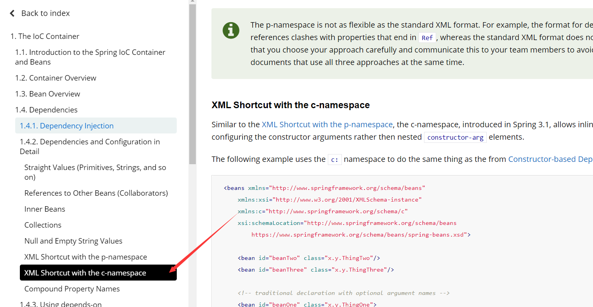


**注意：**p命名和c命名不能直接使用，需要导入xml约束。

**p 命名空间注入**

```
xmlns:p="http://www.springframework.org/schema/p"

<bean id="user" class="edu.cqupt.pojo.User" p:name="shi-lin" p:age="18"/>
```

**C 命名空间注入**

```
 xmlns:c="http://www.springframework.org/schema/c"

 <bean id="user2" class="edu.cqupt.pojo.User" c:name = "shi-lin2" c:age="18"/>
```

## Bean 的作用域

   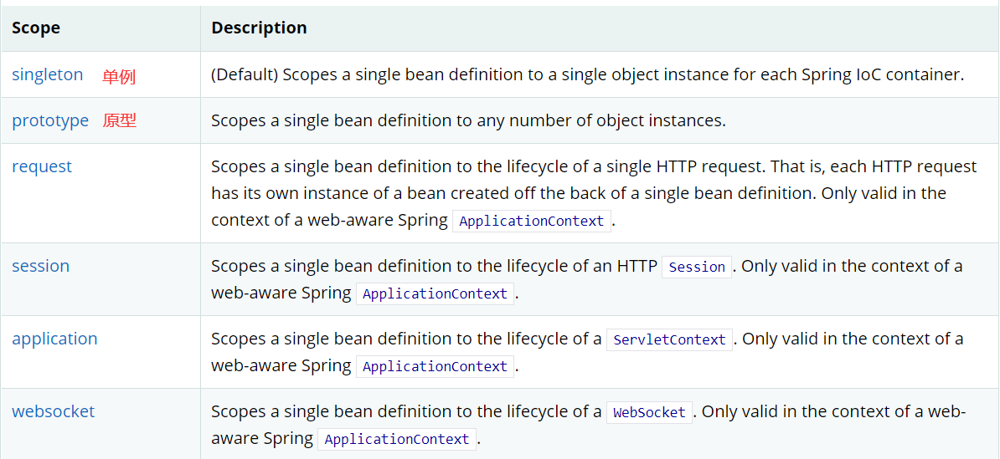


- **singleton (Spring默认机制--单例模式）**

​       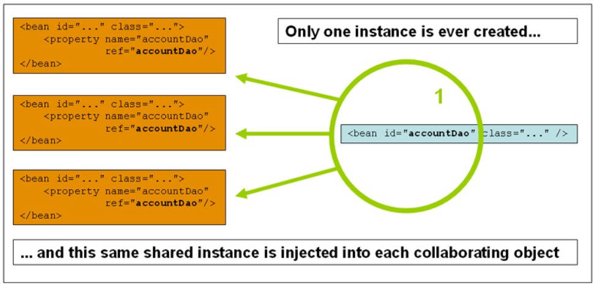

```
 <bean id="user2" class="edu.cqupt.pojo.User" c:name = "shi-lin2" c:age="18" scope="singleton"/>

@Test
    public void test2(){
        ApplicationContext context = new ClassPathXmlApplicationContext("userbeans.xml");
        User user = (User)context.getBean("user2");
        User user2 = (User)context.getBean("user2");
        System.out.println(user == user2);
        System.out.println(user.hashCode());
        System.out.println(user2.hashCode());
    }
```


- **prototypeton (原型模式）**

**每次从容器中get的时候，都会产生一个对象**

​     **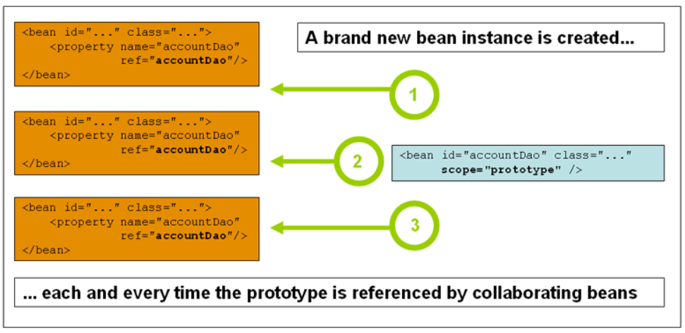**

```
<bean id="user2" class="edu.cqupt.pojo.User" c:name = "shi-lin2" c:age="18" scope="prototype"/>

@Test
    public void test2(){
        ApplicationContext context = new ClassPathXmlApplicationContext("userbeans.xml");
        User user = (User)context.getBean("user2");
        User user2 = (User)context.getBean("user2");
        System.out.println(user == user2);
        System.out.println(user.hashCode());
        System.out.println(user2.hashCode());
    }
```

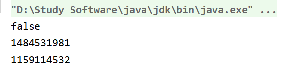

- 其余的request、session、application、这些只能在web开发中使用到！

## Bean 的自动装配

- 自动装配是Spring满足bean依赖的一种方式！
- Spring会在上下文中自动寻找，并自动给bean装备属性
- 在Spring中有三种装配的方式

- - 在xml中显示的装配
  - 在java中显示配置
  - **隐式的自动装配bean**

- 环境搭建

- - 一个人有两个宠物

- **ByName 自动装配**

```
<!-- byNmae 会自动在容器上下文中查找和自己对象set方法后面的值对应的id -->
   <bean id="people" class="edu.cqupt.pojo.People" autowire="byName">
       <property name="name" value="shi-lin"/>
       <!--<property name="cat" ref="cat"/>-->
       <!--<property name="dog" ref="dog"/>-->
   </bean>
```

- **ByType 自动装配**

```
<!-- byNmae 会自动在容器上下文中查找和自己对象set方法后面的值对应的id -->
<!-- byType 会自动在容器上下文中查找和自己对象属性类型相同的bean -->
<bean id="people" class="edu.cqupt.pojo.People" autowire="byType">
    <property name="name" value="shi-lin"/>
  <!--<property name="cat" ref="cat"/>-->
  <!--<property name="dog" ref="dog"/>-->
</bean>
```

- **小结:**

- - byName的时候，需要保证所有bean的id唯一，并且这个bean需要和自动注入的属性的set方法的值唯一
  - byType的时候，需要保证所有bean的class唯一，并且这个bean需要和自动注入的属性的类型一致


- **注解实现装配**

- - JDK 1,5 开始支持注解、 Spring 2.5 开始支持注解
  - 要使用注解

- - - 导入约束。 contex约束
    - 配置注解的支持 **<context:annotation-config/>**

```
<?xml version="1.0" encoding="UTF-8"?>
<beans xmlns="http://www.springframework.org/schema/beans"
    xmlns:xsi="http://www.w3.org/2001/XMLSchema-instance"
    xmlns:context="http://www.springframework.org/schema/context"
    xsi:schemaLocation="http://www.springframework.org/schema/beans
        https://www.springframework.org/schema/beans/spring-beans.xsd
        http://www.springframework.org/schema/context
        https://www.springframework.org/schema/context/spring-context.xsd">

    <context:annotation-config/>
</beans>
```

- - @AutuoWried

   直接在属性上使用即可，也可以在set方式上使用，使用AutoWired我们可以不用编写Set方法了，前提是这个自动的属性在IOC（Spring）容器中存在，且符合名字byName

- - - @Nullable字段标记了这个注解，说明这个字段可以为null

```
public @interface Autowired {
    boolean required() default true;
}


// required = false 说明这个对象可以为null，否则不允许为空
@Autowired(required = false)
private Dog dog;
@Autowired
private Cat cat;
private String name;
```

- - 如果自动装配的环境比较复杂，自动装配无法通过一个注解【@Autuowired】完成的时候，我们可以使用@Qualifier(value = "xxx")去配合@Autuowired使用，指定一个唯一的bean注入使用。
  - @Resource 注解

```
 @Resource(name = "dog222")
```

- - **小结：@Resource 和@Autowired的区别：**

- - - 都是用来自动装配的，都可以放在属性字段上
    - **@Autowired 通过byname的方式实现，而且必须要求这个对象存在【常用】**
    - **@Resource 默认通过byname的方式实现，如果找不到名字，则通过byType实现！如果两个都找不到的情况下，就报错。**

## 使用注解开发

 在Spring4之后，要使用注解，需要导入aop的依赖包，此外还要导入context约束，增加注解的支持。

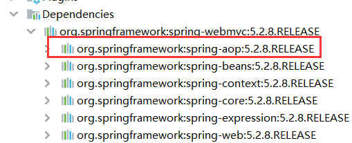

```
<?xml version="1.0" encoding="UTF-8"?>
<beans xmlns="http://www.springframework.org/schema/beans"
       xmlns:xsi="http://www.w3.org/2001/XMLSchema-instance"
       xmlns:context = "http://www.springframework.org/schema/context"
       xsi:schemaLocation="http://www.springframework.org/schema/beans
        https://www.springframework.org/schema/beans/spring-beans.xsd
        http://www.springframework.org/schema/context
        https://www.springframework.org/schema/context/spring-context.xsd">
      <!--指定要扫描的包，这个包下的注解就会生效-->
    <context:component-scan base-package="edu.cqupt"/>
    <context:annotation-config/>
</beans>
```

- bean

@**Component**: 组件，放在类上，说明这个类被Spring管理了，就是bean!

​    等价于：`  <bean id="user" class="edu.cqupt.pojo.User"/>`

- 属性如何注入

**@Value****("shi-lin")** 

**等价于：**`<``**property** ``**name**``**="name"** ``**value**``**="shi-lin"**``/>`

- 衍生的注解

- - @**Component**有几个衍生的注解，我们在web开发中，会安装mvc三层架构分层。

- - - dao【@**Repository**】
    - service【@**Service**】
    - controller【@**Controller**】

- - 这四个注解功能都是一样的，都是代表将某个类注册到Spring中，转配Bean

- 自动装配

- - @**Autowired:** 自动装配通过类型，名字-- 如果 若果Autowired不能唯一自动转配上属性，则需要通过@**Qualified(value="xxx")**
  - **@Nul****lable:** 字段标记了这个注解，说明这个字段可以为null  
  - **@Reso****urce:** 自动装配通过名字，类型

- 作用域

- - @**Scope**(**"singleton"**)
  - @**Scope**(**"prototype"**)

- 小结

- - xml 与 注解：

- - - **xml**：更加万能，适用于任何场合、维护简单方便
    - **注解**： 不是自己的类，使用不了，维护相对复杂

- - 最佳实践

- - - xml用来管理Bean
    - 注解只用于属性注入
    - 在使用的过程中，**只需要注意一个问题，必须让注解生效，开启注解支持**

## JavaConfig实现配置

我们现在要完全不使用Spring的.xml配置了，全权交给Java来做！

JavaConfig是Spring的一个子项目，在Spring4之后，它变成了核心功能

**实体类**

```
@Component  // 说明这个类被Spring接管了，注册到了容器中
public class User {

    private String name;

    public String getName() {
        return name;
    }

    @Value("shi-lin")   // 属性注入值
    public void setName(String name) {
        this.name = name;
    }

    @Override
    public String toString() {
        return "User{" +
                "name='" + name + '\'' +
                '}';
    }
}
```

**配置类**

```
//这个也会被Spring容器托管，注册到容器中，因为他本来就是一个@Component
// @Configuration代表这就是一个配置类，集合我们beans.xml一样
@Configuration
@ComponentScan("edu.cqupt.pojo")
@Import(MyConfig2.class)
public class MyConfig {

    @Bean
    // 注册一个bean，就相当于之前写的一个bean标签
    // 这个方法的名字就相当于bean标签中的id属性，方法的返回值就相当bean标签的class
    public User user(){
        return  new User();     //就是返回要注入的bean对象。
    }

}


@Configuration
public class MyConfig2 {

}
```

**测试类**

```
public class MyTest {
    public static void main(String[] args) {
        // 如果完全使用了配置类方式去做，我们就只能通过AnnotationConfigApplicationContext上下文来获取容器，通过配置类的class对象加载！
        ApplicationContext context = new AnnotationConfigApplicationContext(MyConfig.class);
        User user = context.getBean("user", User.class);
        System.out.println(user.getName());
    }
}
```

**这种纯Java的配置方式，在SpringBoot中随处可见！**

# 代理模式

- 为什么学习代理模式？

- - 因为这就是Spring AOP 的底层！   【Sprign AOP 和 SpringMVC】
  - 代理模式的分类：**静态代理、 动态代理**

## 静态代理

- 角色分析

​             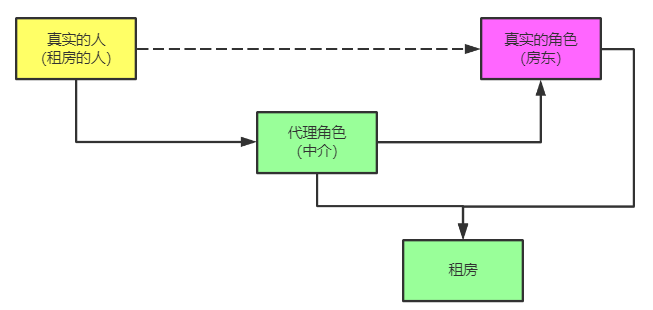

- - 抽象角色： 一般会使用一个接口或者抽象类来实现
  - 真实角色：被代理的角色
  - 代理角色：代理真实角色，代理真实角色后，一般会做一些附属操作
  - 客户：访问代理对象的人 

- 静态代理模式的好处：

- - 可以使真实角色的操作更加纯粹，不用去关注一些公共的业务
  - 公共业务交给代理角色去实现，实现业务的分工
  - 公共业务发生扩展时，方便集中管理

- 静态代理模式的缺点：

- - 一个真实角色就会产生一个代理角色，代码量会翻倍，开发效率会变低。

​       

- 代码步骤

- - 接口

```
package edu.cqupt.demo01;

public interface Rent {
    public void rent();
}
```

- - 真实角色

```
package edu.cqupt.demo01;
// 房东
public class Host implements Rent {

    public void rent() {
        System.out.println("房东的房子租给你了");
    }
}
```

- - 代理角色

```
package edu.cqupt.demo01;
public class Proxy implements Rent {
    private Host host;

    public Proxy() {
    }

    public Proxy(Host host) {
        this.host = host;
    }

    public void rent() {
        host.rent();
    }
    public void say_house(){
        System.out.println("中介带您看房。");
    }
    public void contract(){
        System.out.println("签租赁合同。");
    }
    public void free(){
        System.out.println("收中介费。");
    }
}
```

- - 客户端访问代理角色

```
package edu.cqupt.demo01;
public class Client {
    public static void main(String[] args) {
        Host host  =  new Host();
        Proxy proxy = new Proxy(host);

        proxy.say_house();
        proxy.contract();
        proxy.rent();
        proxy.free();
    }
}
```

**加深理解**

- 代码

- - **UserService** 

```
package edu.cqupt.demo02;

public interface UserService {
    public void add();
    public void delete();
    public void update();
    public void query();
}
```

- - **UserServiceImpl**

```
package edu.cqupt.demo02;

public class UserServiceImpl implements UserService {
    public void add() {
        System.out.println("增加了一个用户");
    }

    public void delete() {
        System.out.println("删除了一个用户");
    }

    public void update() {
        System.out.println("修改了一个用户");
    }

    public void query() {
        System.out.println("查询了一个用户");
    }
}
```

- - **UserServiceProxy**

```
package edu.cqupt.demo02;

public class UserServiceProxy implements UserService {
    private UserServiceImpl userService;

    public void setUserService(UserServiceImpl userService) {
        this.userService = userService;
    }
    public void add() {
        log("add");
        userService.add();
    }
    public void delete() {
        log("delete");
        userService.delete();
    }
    public void update() {
        log("update");
        userService.update();
    }
    public void query() {
        log("query");
        userService.query();
    }
    public void log(String msg){
        System.out.println("[DEBUG]:使用了" + msg + "方法.");
    }
}
```

- - **Client**

```
public class Client {
    public static void main(String[] args) {
        UserServiceImpl userService = new UserServiceImpl();
       UserServiceProxy proxy = new UserServiceProxy();
       proxy.setUserService(userService );
       proxy.delete();
    }
}
```

- 聊聊AOP

​         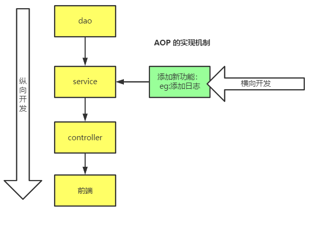

## 动态代理

- 角色分析： 和静态代理角色一样
- 动态代理的代理类是动态生成的，不是我们直接写好的
- 动态代理分类：**基于接口的动态代、基于类的动态代理**

- - **基于接口 --- JDK 动态代理**
  - **基于类  --- cglib\java 字节码实现【javasist】**

需要了解两个类

- Proxy： new出代理
- InvocationHandler： 调用处理程序生成代理


- 动态代理的好处：

- - 可以使真实角色的操作更加纯粹，不用去关注一些公共的业务
  - 公共业务交给代理角色去实现，实现业务的分工
  - 公共业务发生扩展时，方便集中管理
  - 一个动态代理类代理的就是一个接口，一般就是对应的一类业务
  - 一个动态代理类可以代理多个类，只要实现了同一个接口即可。

- **代码步骤**

- - **UserService**

```
public interface UserService {
    public void add();
    public void delete();
    public void update();
    public void query();
}
```

- - **UserServiceImpl**

```
public class UserServiceImpl implements UserService {
    public void add() {
        System.out.println("1：增加了一个用户");
    }

    public void delete() {
        System.out.println("1：删除了一个用户");
    }

    public void update() {
        System.out.println("1:修改了一个用户");
    }

    public void query() {
        System.out.println("1:查询了一个用户");
    }
}
```

- - **UserServiceImplTwo**

```
public class UserServiceImplTwo implements UserService {
    public void add() {
        System.out.println("2：增加了一个用户");
    }

    public void delete() {
        System.out.println("2：删除了一个用户");
    }

    public void update() {
        System.out.println("2：修改了一个用户");
    }

    public void query() {
        System.out.println("2：查询了一个用户");
    }
}
```

- - **ProxhyInvocationHandler**

```
import java.lang.reflect.InvocationHandler;
import java.lang.reflect.Method;
import java.lang.reflect.Proxy;

// 等会我们用这个类，自动生成代理类
public class ProxyInVocationHandler implements InvocationHandler {

    private Object target;
    public void setTarget(Object target) {
        this.target = target;
    }
    public Object getProxy(){// 生成得到代理类
        return Proxy.newProxyInstance(this.getClass().getClassLoader(),
                target.getClass().getInterfaces(),this);
    }
    // 动态代理的本质，就是使用反射机制实现
    // 处理代理实例，并返回结果
    public Object invoke(Object proxy, Method method, Object[] args) throws Throwable {
        log(method.getName());
        Object result = method.invoke(target,args);
        return  result;
    }
    // 给代理添加功能
    public void log(String msg){
        System.out.println("[Debug]:执行了" + msg + "方法。");
    }
}
```

- - **Client**

```
package edu.cqupt.demo04;

public class Client {
    public static void main(String[] args) {
        // 真实角色
        UserServiceImpl userService  = new UserServiceImpl();
        UserServiceImplTwo userServiceTwo  = new UserServiceImplTwo();
        // 代理角色
        ProxyInVocationHandler pih = new ProxyInVocationHandler();
        pih.setTarget(userService);// 设置要代理对象
        //pih.setTarget(userServiceTwo);
        UserService proxy = (UserService) pih.getProxy();     // 动态生成代理类
        proxy.add();
        proxy.delete();
        proxy.update();
        proxy.query();
    }
}
```

# AOP

## 什么是AOP

AOP为Aspect Oriented Programming的缩写，意为：**面向切面编程**，通过预编译方式和运行期间动态代理实现程序功能的统一维护的一种技术。AOP是OOP的延续，是软件开发中的一个热点，也是Spring框架中的一个重要内容，是**函数式编程**的一种衍生范型。**利用AOP可以对业务逻辑的各个部分进行隔离，从而使得业务逻辑各部分之间的耦合度降低，提高程序的可重用性，同时提高了开发的效率。**

   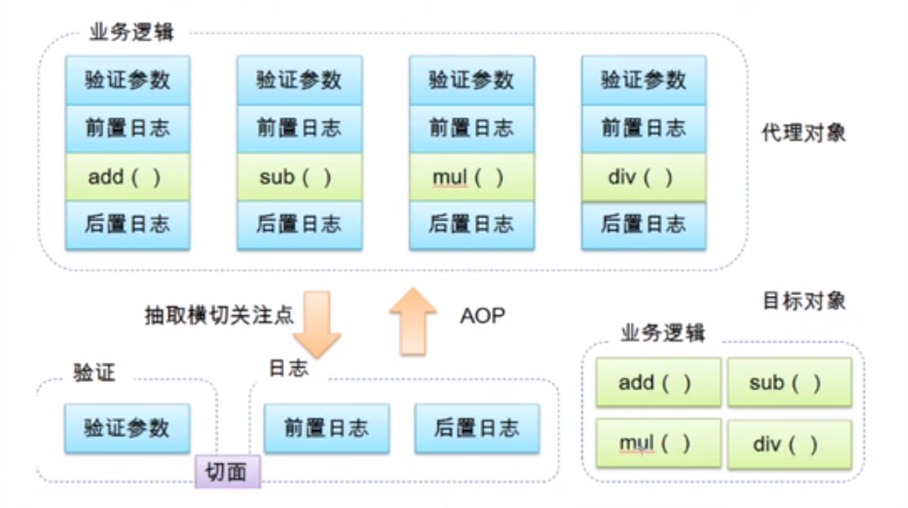

## AOP 在Spring中的作用


**提供声明式事务:允许用户自定义切面：**

- **横切关注点:** 跨越应用程序多个模块的方法或功能.既是,与我们业务逻辑无关,但是我们需要关注的部分,就是横切关注点 .如**日志,安全,缓存,事务**等…
- **切面（ASPECT）：**横切关注点 被模块化 的特殊对象。即，它是一个**类**。
- **通知（Advice）：**切面必须要完成的工作。即，它是类中的一个**方法**。
- **目标（Target）：**被通知对象。
- **代理（Proxy）：**向目标对象应用通知之后创建的对象。
- **切入点（PointCut）：**切面通知 执行的 “地点”的定义。
- **连接点（JointPoint）：**与切入点匹配的执行点。


   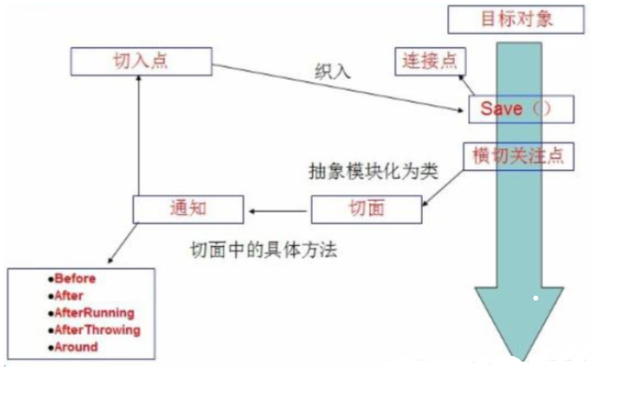

SpringAOP中，通过Advice定义横切逻辑，Spring中支持5种类型的Advice:

​             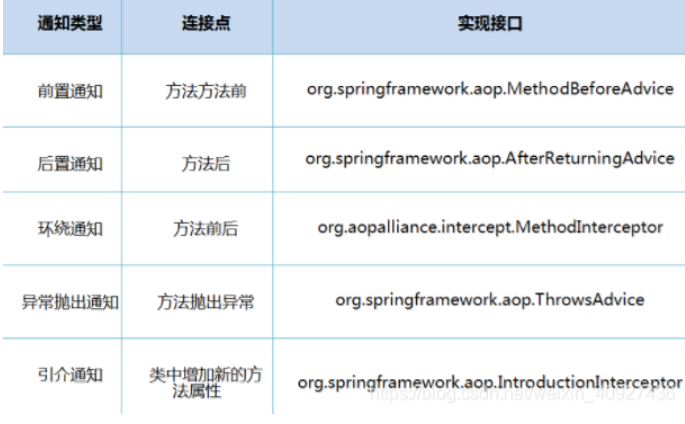

 Aop 在 不改变原有代码的情况下 , 去增加新的功能。

## 使用Spring 实现AOP


- 方式一： 使用Spring的API接口
- 方式二： 使用自定义类实现AOP 
- 方式三： 使用注解实现


## 整合Mybatis

步骤：

- 导入jar包

- - junit
  - mybatis
  - mysql数据库
  - spring
  - aspectjweaver
  - mybatis-spring  

- 编写配置文件
- 测试

```
    <dependencies>
        <!-- https://mvnrepository.com/artifact/org.springframework/spring-webmvc -->
        <dependency>
            <groupId>org.springframework</groupId>
            <artifactId>spring-webmvc</artifactId>
            <version>5.2.8.RELEASE</version>
        </dependency>
        <dependency>
            <groupId>junit</groupId>
            <artifactId>junit</artifactId>
            <version>4.12</version>
        </dependency>
        <dependency>
            <groupId>org.aspectj</groupId>
            <artifactId>aspectjweaver</artifactId>
            <version>1.9.4</version>
        </dependency>
        <dependency>
            <groupId>mysql</groupId>
            <artifactId>mysql-connector-java</artifactId>
            <version>5.1.47</version>
        </dependency>
        <dependency>
            <groupId>org.mybatis</groupId>
            <artifactId>mybatis</artifactId>
            <version>3.5.2</version>
        </dependency>
        <dependency>
            <groupId>org.springframework</groupId>
            <artifactId>spring-jdbc</artifactId>
            <version>5.1.9.RELEASE</version>
        </dependency>
        <dependency>
            <groupId>org.mybatis</groupId>
            <artifactId>mybatis-spring</artifactId>
            <version>2.0.2</version>
        </dependency>
        <dependency>
            <groupId>org.projectlombok</groupId>
            <artifactId>lombok</artifactId>
            <version>1.16.10</version>
        </dependency>
    </dependencies>
    <!--在build中配置resources，来防止我们资源导出失败的问题-->
    <build>
        <resources>
            <resource>
                <directory>src/main/java</directory>
                <includes>
                    <include>**/*.xml</include>
                </includes>
                <filtering>true</filtering>
            </resource>
        </resources>
    </build>
```


### 回忆Mybatis 

1. 编写实体类

```
import lombok.Data;

@Data
public class User {
    private int id;
    private String name;
    private String pwd;
}
```

1. 编写核心配置文件

```
<?xml version="1.0" encoding="UTF-8"?>
<!DOCTYPE configuration
        PUBLIC "-//mybatis.org//DTD Config 3.0//EN"
        "http://mybatis.org/dtd/mybatis-3-config.dtd">

<configuration>
    <typeAliases>
        <package name="edu.cqupt.pojo"/>
    </typeAliases>
    <environments default="development">
        <environment id="development">
            <transactionManager type="JDBC"/>
            <dataSource type="POOLED">
                <property name="driver" value="com.mysql.jdbc.Driver"/>
                <property name="url" value="jdbc:mysql://localhost:3306/mybatis?useSSL=true&amp;useUnicode=true&amp;characterEncoding=UTF-8"/>
                <property name="username" value="root"/>
                <property name="password" value="123456"/>
            </dataSource>
        </environment>
    </environments>
    <mappers>
        <mapper class="edu.cqupt.mapper.UserMapper"/>
    </mappers>
</configuration>
```

1. 编写接口

```
public interface UserMapper {
    public List<User> selectUser();
}
```

1. 编写Mapper.xml

```
<?xml version="1.0" encoding="UTF-8"?>
<!DOCTYPE mapper
        PUBLIC "-//mybatis.org//DTD Config 3.0//EN"
        "http://mybatis.org/dtd/mybatis-3-mapper.dtd">

<mapper namespace="edu.cqupt.mapper.UserMapper">
    <select id="selectUser" resultType="User">
        select * from mybatis.user;
    </select>
</mapper>
```

1. 测试

```
public class MyTest {
    @Test
    public void test() throws IOException {
        String resource = "mybatis-config.xml";
        InputStream in = Resources.getResourceAsStream(resource);
        SqlSessionFactory sqlSessionFactory = new SqlSessionFactoryBuilder().build(in);
        SqlSession sqlSession = sqlSessionFactory.openSession(true);

        UserMapper mapper = sqlSession.getMapper(UserMapper.class);
        List<User> userList = mapper.selectUser();
        for (User user : userList) {
            System.out.println(user);
        }
    }
}
```

### Mybatis-Spring

MyBatis-Spring 会帮助你将 MyBatis 代码无缝地整合到 Spring 中。**它将允许 MyBatis 参与到 Spring 的事务管理之中**，创建映射器 mapper 和 SqlSession 并注入到 bean 中，以及将 Mybatis 的异常转换为 Spring的

 DataAccessException。最终，可以做到应用代码不依赖于 MyBatis，Spring 或 MyBatis-Spring。


1. 编写数据源配置
2. sqlSessionFactory
3. sqlSessionTemplate

- **spring-dao.xml**

```
<?xml version="1.0" encoding="UTF-8"?>
<beans xmlns="http://www.springframework.org/schema/beans"
       xmlns:xsi="http://www.w3.org/2001/XMLSchema-instance"
       xsi:schemaLocation="http://www.springframework.org/schema/beans
        https://www.springframework.org/schema/beans/spring-beans.xsd">

        <!--DataSource: 使用Spring的数据源替换mybatis的配置 c3p0 dbcp druid
            我们使用Spring提供的jdbc-->
        <bean id="dataSource" class="org.springframework.jdbc.datasource.DriverManagerDataSource">
            <property name="driverClassName" value="com.mysql.jdbc.Driver"/>
            <property name="url" value="jdbc:mysql://localhost:3306/mybatis?useSSL=true&amp;useUnicode=true&amp;characterEncoding=UTF-8"/>
            <property name="username" value="root"/>
            <property name="password" value="123456"/>
        </bean>
        <!--SqlSessionFactory-->
        <bean id="sqlSessionFactory" class="org.mybatis.spring.SqlSessionFactoryBean">
            <property name="dataSource" ref="dataSource" />
            <!--绑定Mybatis配置文件-->
            <property name="configLocation" value="classpath:mybatis-config.xml"/>
            <property name="mapperLocations" value="classpath:edu/cqupt/mapper/*.xml"/>
        </bean>

        <!--SqlSessionTemplate 就是我们使用的的SqlSession-->
        <bean id="sqlSession" class="org.mybatis.spring.SqlSessionTemplate">
            <!--只能使用构造器注入SqlSessionFactory 因为他没有set方法-->
            <constructor-arg index="0" ref="sqlSessionFactory"/>
        </bean>

</beans>
```

1. 需要给接口加实现类  

- **UserServiceImpl**

```
package edu.cqupt.mapper;

import edu.cqupt.pojo.User;
import org.mybatis.spring.SqlSessionTemplate;

import java.util.List;

public class UserMapperImpl implements UserMapper {
    //在原来我们的所有操作都使用SqlSession来执行，现在都使用SqlSessionTemplate;
    private SqlSessionTemplate sqlSession;

    public void setSqlSession(SqlSessionTemplate sqlSession) {
        this.sqlSession = sqlSession;
    }

    public List<User> selectUser() {
        UserMapper mapper = sqlSession.getMapper(UserMapper.class);
        List<User> userList = mapper.selectUser();
        return userList;
    }
}
```

1. 将自己写的实现类，注入到Spring中

- **applicationContext.xml**  

```
<?xml version="1.0" encoding="UTF-8"?>
<beans xmlns="http://www.springframework.org/schema/beans"
       xmlns:xsi="http://www.w3.org/2001/XMLSchema-instance"
       xmlns:context = "http://www.springframework.org/schema/context"
       xmlns:aop = "http://www.springframework.org/schema/aop"
       xsi:schemaLocation="http://www.springframework.org/schema/beans
        https://www.springframework.org/schema/beans/spring-beans.xsd
        http://www.springframework.org/schema/context
        https://www.springframework.org/schema/context/spring-context.xsd
        http://www.springframework.org/schema/aop
        https://www.springframework.org/schema/aop/spring-aop.xsd">

    <!--指定要扫描的包，这个包下的注解就会生效-->
    <context:component-scan base-package="edu.cqupt"/>
    <context:annotation-config/>

    <import resource="spring-dao.xml"/>

    <bean id="userMapper" class="edu.cqupt.mapper.UserMapperImpl">
        <property name="sqlSession" ref="sqlSession"/>
    </bean>
</beans>
```

1. 测试使用即可

- **MyTest.java**

```
public class MyTest {
    @Test
    public void test() throws IOException {
       ApplicationContext context = new ClassPathXmlApplicationContext("applicationContext.xml");
        UserMapper userMapper = context.getBean("userMapper", UserMapper.class);
        List<User> userList = userMapper.selectUser();
        for (User user : userList) {
            System.out.println(user);
        }
    }
}
```

- 第二种整合方式

```
第一种方式的ApplicationContext.xml
<bean id="userMapper" class="edu.cqupt.mapper.UserMapperImpl">
        <property name="sqlSession" ref="sqlSession"/>
 </bean>
第二种方式的ApplicationContext.xml
<bean id="userMapper" class="edu.cqupt.mapper.UserMapperImpl">
        <property name="sqlSessionFactory" ref="sqlSessionFactory"/>
</bean>
```

- **UserMapperImpl** 

- - **继承** **SqlSessionDaoSupport**
  - 使用**getSqlSession()**方法获得SqlSession

```
public class UserMapperImpl extends SqlSessionDaoSupport implements UserMapper {
    public List<User> selectUser() {
        UserMapper mapper = getSqlSession().getMapper(UserMapper.class);
        return mapper.selectUser();
    }
}
```

## Spring 事务

- 事务：

- - 对数据库的操作，要么都做，要么都不做。

- 事务的四大特性：

- - A：原子性
  - C：一致性
  - I :  隔离性
  - D：持续性

-  Spring 实现 事务

- - UserMapper接口: insert、delete、update才会用到事务

```
public interface UserMapper {
    public List<User> selectUser();
    public int addUser(User user);
    public int deleteUser(int id);
}
```

- - **UserMapperImpl实现类: mybatis的第二种整合方式**

```
public class UserMapperImpl extends SqlSessionDaoSupport implements UserMapper {
    public List<User> selectUser() {
        User user = new User(9,"xiaowang","123456");
        UserMapper mapper = getSqlSession().getMapper(UserMapper.class);
        mapper.addUser(user);

        return mapper.selectUser();
    }
    public int addUser(User user) {
        return getSqlSession().getMapper(UserMapper.class).addUser(user);
    }

    public int deleteUser(int id) {
        return getSqlSession().getMapper(UserMapper.class).deleteUser(9);
    }
}
```

- - **UserMapper.xml**

```
<?xml version="1.0" encoding="UTF-8"?>
<!DOCTYPE mapper
        PUBLIC "-//mybatis.org//DTD Config 3.0//EN"
        "http://mybatis.org/dtd/mybatis-3-mapper.dtd">

<mapper namespace="edu.cqupt.mapper.UserMapper">
    <select id="selectUser" resultType="User">
        select * from mybatis.user;
    </select>

    <insert id="addUser" parameterType="User">
        insert into mybatis.user(id,name,pwd) values (#{id},#{name},#{pwd});
    </insert>

    <delete id="deleteUser" parameterType="int">
        delete from mybatis.user where id = #{id};
    </delete>
</mapper>
```

- - **spring-dao.xml** 里面添加事务相关的配置

```
<?xml version="1.0" encoding="UTF-8"?>
<!DOCTYPE mapper
        PUBLIC "-//mybatis.org//DTD Config 3.0//EN"
        "http://mybatis.org/dtd/mybatis-3-mapper.dtd">

<mapper namespace="edu.cqupt.mapper.UserMapper">
    <select id="selectUser" resultType="User">
        select * from mybatis.user;
    </select>

    <insert id="addUser" parameterType="User">
        insert into mybatis.user(id,name,pwd) values (#{id},#{name},#{pwd});
    </insert>

    <delete id="deleteUser" parameterType="int">
        delete from mybatis.user where id = #{id};
    </delete>
</mapper>
```

- - **applicationContext.xml**

```
<?xml version="1.0" encoding="UTF-8"?>
<beans xmlns="http://www.springframework.org/schema/beans"
       xmlns:xsi="http://www.w3.org/2001/XMLSchema-instance"
       xmlns:context = "http://www.springframework.org/schema/context"
       xmlns:aop = "http://www.springframework.org/schema/aop"
       xsi:schemaLocation="http://www.springframework.org/schema/beans
        https://www.springframework.org/schema/beans/spring-beans.xsd
        http://www.springframework.org/schema/context
        https://www.springframework.org/schema/context/spring-context.xsd
        http://www.springframework.org/schema/aop
        https://www.springframework.org/schema/aop/spring-aop.xsd">

    <!--指定要扫描的包，这个包下的注解就会生效-->
    <context:component-scan base-package="edu.cqupt"/>
    <context:annotation-config/>

    <import resource="spring-dao.xml"/>

    <bean id="userMapper" class="edu.cqupt.mapper.UserMapperImpl">
        <property name="sqlSessionFactory" ref="sqlSessionFactory"/>
    </bean>
</beans>
```

- 